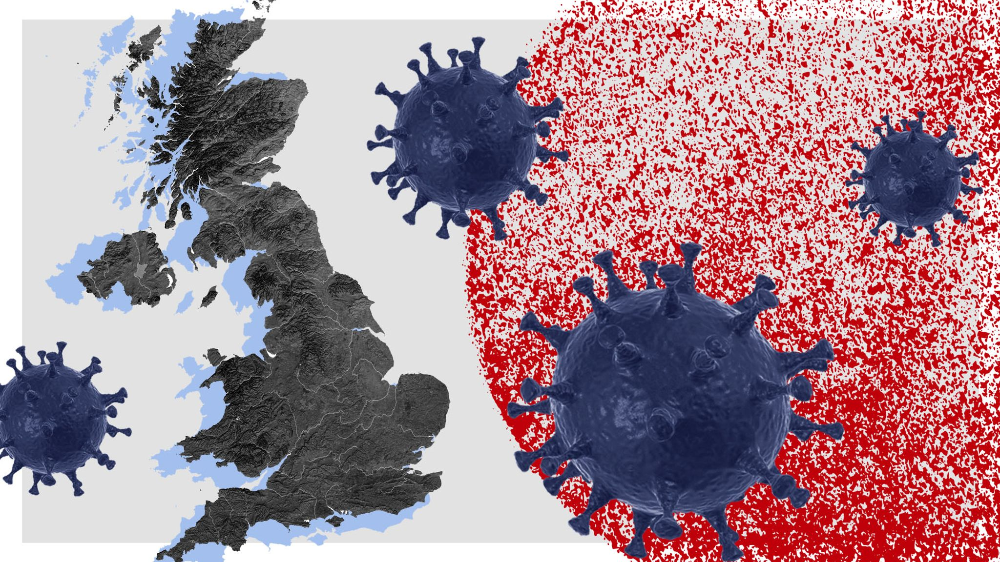

## 

```{r setup, include = FALSE}
library(tidyverse)
library(sparkline)
library(DT)
library(stargazer)
library(knitr)
library(kableExtra)
library(broom)
library(tidycat)
library(scales)
library(dplyr)
library(ggplot2)
library(plotly)
knitr::opts_chunk$set(
  echo = FALSE,
  message = FALSE,
  warning = FALSE
)
select <- dplyr::select
```

## Exploring COVID-19 daily data for the United Kingdom
<br>

```{r external-image, out.width='60%', fig.align='center'}
# adding the figure 1

```

<br>  

### 1. Introduction 

At the beginning of 2020, COVID-19 was first found and broke out in Wuhan, China. Then, the disease rapidly spread and broke out in more than 188 countries and regions around the world. In this blog, I focus on the spread and control of COVID-19 in the United Kingdom. The story of this disease spread in the UK begins to be told through three tables and one interactive graph.

<br> 

### 2. Data Description
  
The data used here was retrieved from https://github.com/owid/covid-19-data/tree/master/public/data. The "Our World Data" is the organization that maintains this data, which is updated daily and includes data on confirmed cases, deaths, and testing, as well as other variables of potential interest from several countries. To the purpose of this post, only the data from the United Kingdom was selected.

<br> 

### 3. Data Analysis  

According to this dataset, the United Kingdom started to record the COVID-19 information from February 2020. The data selected to display in the tables are updated up to August 2020.  
  
By Table 1, we compiled the daily information of confirmed cases, deaths and tests, recorded in the daily bases and the accumulated basis. This interactive table is designed for user data exploration, being possible filtering, searching, and sorting the data. Therefore, readers can explore the data by themselves.

The data shows that the total Covid-19 cases in the UK are 334,467, and the total number of deaths is 41,499 (up to August, 31).

<br> 
  
```{r adjusting-original-dataset}
dt2_COVID <- read.csv("owid-covid-data.csv")
UK_df2 <- dt2_COVID %>%
  filter(location == "United Kingdom") 
UK_df2_B <- UK_df2[-(246:247),]
UK_df2_B <- UK_df2_B[-(1:32),]
UK_df2_B$date2 <- as.Date(UK_df2_B$date)
UK_df2_B$Month <- months(UK_df2_B$date2)
UK_df2_B$Month = factor(UK_df2_B$Month, levels=c('February','March','April','May','June','July','August'))
```


```{r DT-interactiveTable1}
UK_df2BB = UK_df2_B[,c("date2","total_cases", "new_cases", "total_deaths", "new_deaths", "total_tests", "new_tests")]

datatable(UK_df2BB, 
          filter = 'top', 
          options = list(pageLength = 5, autoWidth = TRUE), 
          rownames = FALSE, 
          caption = 'Table 1: Daily COVID-19 data from UK',
          colnames = c('Date', 'Total Cases', 'New Cases', 'Total Deaths', 'New Deaths', 'Total Tests', 'New Tests')
          ) 
```
  
<br>  
  
In Tables 2 and 3, we have numerical summary statistics linked to UK Covid-19 cases. Table 2 summarizes the daily statistic for the new confirmed cases, deaths and tests. By this table, we can notice that the total average of new cases is (up to August) 1,570 cases per day and the more critical day presented 5,487 new cases in only one day. If we search for this value in Table 1, we will see that this record corresponds to April 24. The worst death day was April 22, with 1,224 deaths.

<br> 

```{r staticSummaryTable2-kable}

UK_df2BB[,c(3,5,7)] %>% 
  select_if(is.numeric) %>% 
  pivot_longer(everything(), values_to = "value", names_to = "covariate") %>% 
  group_by(covariate) %>% 
  filter(!is.na(value)) %>% 
  summarise(n = n(), mean = mean(value), sd = sd(value), min = min(value),
            Q1 = quantile(value, 0.25), 
            Q3 = quantile(value, 0.75), max = max(value)) %>% 
  mutate(covariate = recode(covariate,
                          new_cases = "New Cases",
                          new_deaths = "New Deaths",
                          new_tests = "New Tests"),
         mean = comma(mean),
         sd = comma(sd),
         min = comma(round(min, 0)), max = comma(round(max, 0)), 
         Q1 = round(Q1, 0), Q3 = round(Q3, 0)) %>% 
  kable(col.names = c("Statistic", "Days of Measure", "Daily Average", "Daily St. Dev.", "Minimum", "Pctl(25)", "Pctl(75)", "Maximum"), 
        caption = "Table 2: Summary Daily Statistics", align = "lrrrrrrr",
        booktabs = TRUE) %>%
  kable_styling(full_width = T) %>%
  kable_styling(bootstrap_options = c("striped", "hover")) 
```
  
<br>   

By Table 3, we observe that April was the worst month in terms of confirmed cases and number of deaths. The data shows that seems the UK is experiencing a second wave of Covid-19 during August since the total and average of new cases returned to increase. This fact is also demonstrated in Graph 1, where we can notice the acceleration of the curve of the total cases (blue curve). However, despite this apparent 2nd wave, on August the daily average and peak of deaths remain decreasing comparing with previous months (as also shown by stabilization of red curve on Graph 1), indicating that the treatments against Covid-19 are more efficient now. By these numbers, we could infer that the UK has evolved in the treatment of Covid-19 patients.

<br> 

```{r staticSummaryTable3-kable}
cols <- c('Month', 'new_cases', 'new_deaths')

UK_df3 <- UK_df2_B[cols]
UK_df3_list1 <- split(UK_df3$new_cases, UK_df3$Month)
UK_df3_list1b <- list(UK_df3_list1$February,
                      UK_df3_list1$March,
                      UK_df3_list1$April,
                      UK_df3_list1$May,
                      UK_df3_list1$June,
                      UK_df3_list1$July,
                      UK_df3_list1$August)

UK_df3_list2 <- split(UK_df3$new_deaths, UK_df3$Month)
UK_df3_list2b <- list(UK_df3_list2$February,
                      UK_df3_list2$March,
                      UK_df3_list2$April,
                      UK_df3_list2$May,
                      UK_df3_list2$June,
                      UK_df3_list2$July,
                      UK_df3_list2$August)

UK_df3 %>% 
  group_by(Month) %>% 
  summarise(Tot_Cases = comma(round(sum(new_cases),0)),
            Avg_Cases = comma(round(mean(new_cases),0)),
            Max_Cases = comma(round(max(new_cases),0)),
            Min_Cases = comma(round(min(new_cases),0)),
            Histogram = "",
            Tot_Deaths = comma(round(sum(new_deaths),0)),
            Avg_Deaths = comma(round(mean(new_deaths),0)),
            Max_Deaths = comma(round(max(new_deaths),0)),
            Min_Deaths = comma(round(min(new_deaths),0)),
            Boxplot ="") %>%
  kable(caption = "Table 3: Summary Statistics per Month", align = "lrrrrrrrrrr", booktabs = TRUE) %>%
  kable_styling(full_width = F) %>%
  kable_styling(bootstrap_options = c("striped", "hover")) %>%
  column_spec(6, image = spec_hist(UK_df3_list1b)) %>%
  column_spec(11, image = spec_boxplot(UK_df3_list2b))

```

<br> 

```{r graph-1, fig.cap="Graph 1: Accumulated new cases and deaths from February to August 2020", fig.width=10}
p1 <- UK_df2BB %>%
  ggplot(aes(x = date2)) +
  geom_line(aes(y = (total_cases)/1000, colour="total_cases")) +
  geom_line(aes(y = (total_deaths)/1000, colour = "total_deaths")) +
  scale_colour_manual("", 
                      breaks = c("total_cases", "total_deaths"),
                      values = c("blue", "red")) +
  xlab(" ") +
  ylab("thousands of cases / deaths") +
  theme(axis.text.x = element_blank()) +
  ggtitle("This is an interactive graph. Click over the lines to see the data details.")
ggplotly(p1) %>%
        config(displayModeBar = F)
``` 
