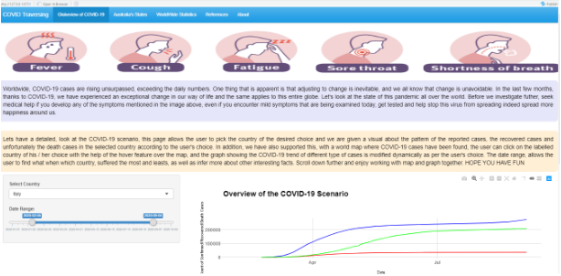

```{r setup, include = FALSE}
knitr::opts_chunk$set(
  echo = FALSE,
  message = FALSE,
  warning = FALSE
)
select <- dplyr::select
```
<br>

## CovidShiny R-package - a peer review

<br>

```{r external-image, out.width='50%', fig.align='left', fig.cap="Source: https://github.com/etc5523-2020/r-package-assessment-priya51096"}
# adding the figure 

```

### - Post Aim
The aim of this 4th blog-post is to make a peer review of an R-package developed by one of my classmates while cursing the "ETC5523-Communicating with Data" unit at Monash University. The package that I will review is called `prikage` and it was developed by **Ms. Priya Ravindra Dingorkar.**

<br> 

### - Package Overview


<br> 

### - Working Review
  

<br> 

### - Suggestions for improvement


<br> 

### - What I have learned 

<br> 

### - Appendix 

#### Package Review Checklist

#### a. Documentation:
The package includes all the following forms of documentation: 

- [ YES ] **Installation instructions:** for the package is found in README
- [ YES ] **Vignette(s)** demonstrating major functionality that runs successfully locally
- [ YES ] **Function Documentation:** for all exported functions in R help
- [ NO ] **Examples** for all exported functions in R Help that run successfully locally --> *ANSWER: For all 6 exported functions built for the package were not provided any example.*


#### b. Functionality: 

- [ YES ] **Installation:** Installation succeeds as documented. 

- [ YES ] **Functionality:** Any functional claims of the software been confirmed. --> *ANSWER:  Concerning to the overall test `devtools::check()`, running it locally in my machine, returned 0 errors, 0 warnings, but 2 notes about the absense of usage of some global functions. The check result recommended the definition of some global functions inside two external functions built for this package: `date_slider_input()`, `select_input_world_countries()`.* 

- [ More or Less ] **Automated tests:** Unit tests cover essential functions of the package
and a reasonable range of inputs and conditions. All tests pass on the local machine. --> *ANSWER: The units tests covered only two of the six functions of the package. Just one input was tested for each test created. Using the `devtools::test()`, all tests passed locally in my machine without errors but with 32 warnings.*


